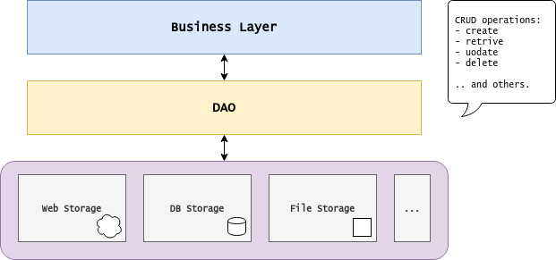

Java Patterns | Data Access Object
===

The **data access object** is an arquitectural design pattern. It proposes a layered arquitecture,
promoting decoupling of classes containing *business logic* from *data access* and corresponding persistence mechanisms:



The generic `DAO<T,K>` *interface* describes CRUD operations for a **data object** of type `T` and unique key of type `K`:

```java
public interface Dao<T, K> {
    T get(K key);
    Collection<T> getAll();
    void save(T instance) throws DaoException;
    void update(T instance) throws DaoException;
    T delete(K key);
    int count();
}
```
## Features

- Written in Java Language.
- No installation necessary - just use the binary.
- Works on Mac, Linux and Windows.

## How to run

Prerequisites: JavaSE-15 and MySQL Connector/J 8.0.25

```bash
# clone the repository
git clone https://github.com/yihongz/chess

# enter inside the project source folder 
cd src

# execute it
java application/Program
```

## Authors
- [Paulo Almeida](https://github.com/yihongz)
